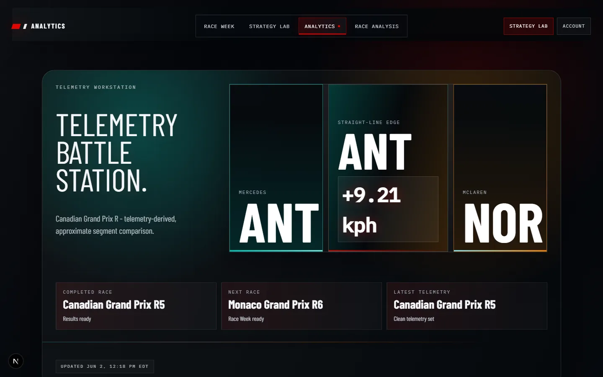

# F1 InsightX

**Premium F1 telemetry and race intelligence.**

F1 InsightX turns deterministic FastF1 data pipelines into focused race-week, strategy, telemetry, and post-race product experiences. The Next.js application reads compact offline-generated product views; it never parses raw telemetry at runtime.

## Product Preview

### Analytics · Telemetry Workstation

Driver-vs-driver telemetry comparison with real circuit geometry, approximate segment analysis, synchronized product views, and honest energy deployment proxies.



### Race Analysis · Post-Race Intelligence

A cinematic completed-race report built from observed results and deterministic pace, stint, strategy, weather, track-status, traffic-proxy, and position-movement views.


### Race Week · Weekend Command Center

Upcoming-race context, schedule state, circuit features, conditions, and generated race-week signals presented without inventing unavailable session data.


## Product Surfaces

- **Analytics**: telemetry-derived driver comparison using indexed, session-scoped product shards.
- **Race Analysis**: completed-race story, strategy, pace evolution, weather, track-status, traffic-proxy, and position-movement views.
- **Strategy Lab**: deterministic stint and race-strategy simulation with explicit assumptions and sensitivity drivers.
- **Race Week**: current weekend context, schedule, conditions, circuit metadata, and pre-session signals.
- **Account/Profile**: Supabase-backed authentication, profile, privacy, and account-management flows.

## Architecture

```text
FastF1 archive
  -> staged session extracts
  -> canonical FastF1 tables
  -> telemetry and deterministic feature layers
  -> compact product views and indexes
  -> Next.js server-first product surfaces
```

| Layer | Purpose |
| --- | --- |
| `data/raw/fastf1` | Generated FastF1 archive, manifests, and cache-adjacent artifacts |
| `data/staged/fastf1` | Generated per-session extracts |
| `data/canonical_fastf1` | Validated canonical laps, results, stints, sessions, and weather |
| `data/telemetry_features` | Telemetry-derived segment, braking, throttle, straight-line, and energy-proxy features |
| `data/strategy_lab` | Deterministic Strategy Lab product views |
| `data/analytics` | Analytics product views and indexed session shards |
| `data/race_analysis` | Completed-race intelligence views |
| Supabase | Authentication, profiles, and deployable database-backed surfaces |

## Local Development

Requirements: Node.js 20+, npm 10+, Python 3.11+, and the Python packages in `data/requirements.txt`.

```bash
npm install
npm run data:install
npm run dev
```

Create `.env.local` from `.env.example` only when testing Supabase-backed auth and profile flows. Never commit real environment files or secrets.

## Validation

```bash
npm run test --workspace web
npm run typecheck
npm run lint --workspace web
npm run build --workspace web
python check_generated_artifacts.py
python validate_product_manifest.py
```

## Data Refresh

Core deterministic refresh order:

```bash
python build_canonical_fastf1.py --start-season 2020 --end-season 2026
python validate_canonical_fastf1.py
python build_telemetry_features.py --start-season 2020 --end-season 2026
python validate_telemetry_features.py
python data/build_strategy_lab_layers.py
python data/build_analytics_views.py
python data/build_analytics_indexes.py
python validate_analytics_views.py
python build_product_manifest.py
python validate_product_manifest.py
python check_generated_artifacts.py
```

## Product Integrity

- Energy deployment is a **proxy**, not true ERS or battery telemetry.
- Analytics uses **approximate segments** and does not claim unverified named-corner precision.
- Position movement, traffic, DRS-window, and dirty-air values remain explicitly labelled as proxies where exact evidence is unavailable.
- Race-control causes and exact overtakes are not invented.
- Strategy Lab presents deterministic scenario ranges and assumptions, not ML predictions.

## Artifact and Deployment Policy

Commit source, SQL, migrations, tests, documentation, fixtures, and intentionally small runtime product views. Do not commit raw FastF1 archives, cache data, parquet telemetry, canonical CSVs, telemetry feature CSVs, or large generated Analytics and Race Analysis outputs without an explicit release decision.

The web app targets Vercel using Next.js App Router. Supabase-backed auth/profile flows require:

- `NEXT_PUBLIC_SUPABASE_URL`
- `NEXT_PUBLIC_SUPABASE_ANON_KEY`
- `SUPABASE_SERVICE_ROLE_KEY`
- `NEXT_PUBLIC_APP_URL`
- `NEXT_PUBLIC_PRIVACY_CONTACT_EMAIL`

See [Release Checklist](docs/RELEASE_CHECKLIST.md) for the runtime artifact matrix, build order, Supabase checks, deployment flow, and post-deploy QA.

## Documentation

- [Development](docs/DEVELOPMENT.md)
- [Data Pipeline](docs/DATA_PIPELINE.md)
- [Data Sources](docs/data-sources.md)
- [Analytics](docs/ANALYTICS.md)
- [Strategy Lab](docs/STRATEGY_LAB.md)
- [Deployment](docs/deployment.md)
- [Supabase Auth Setup](docs/supabase-auth-setup.md)
- [Release Checklist](docs/RELEASE_CHECKLIST.md)
