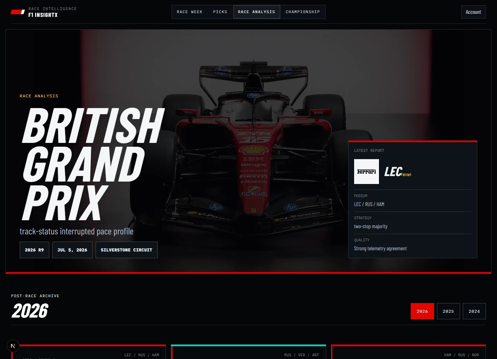
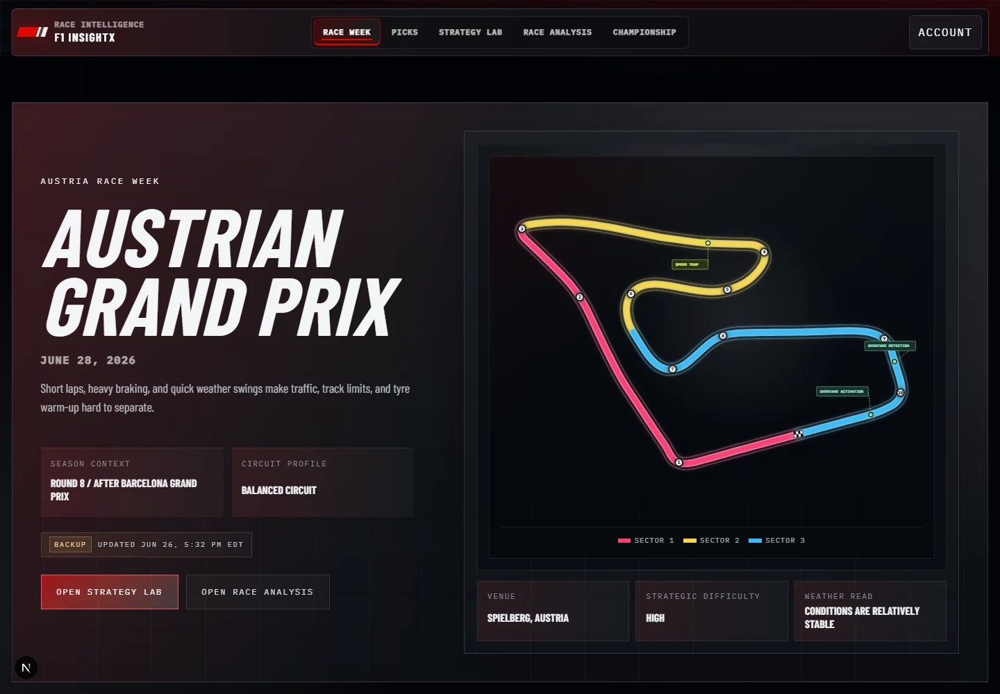
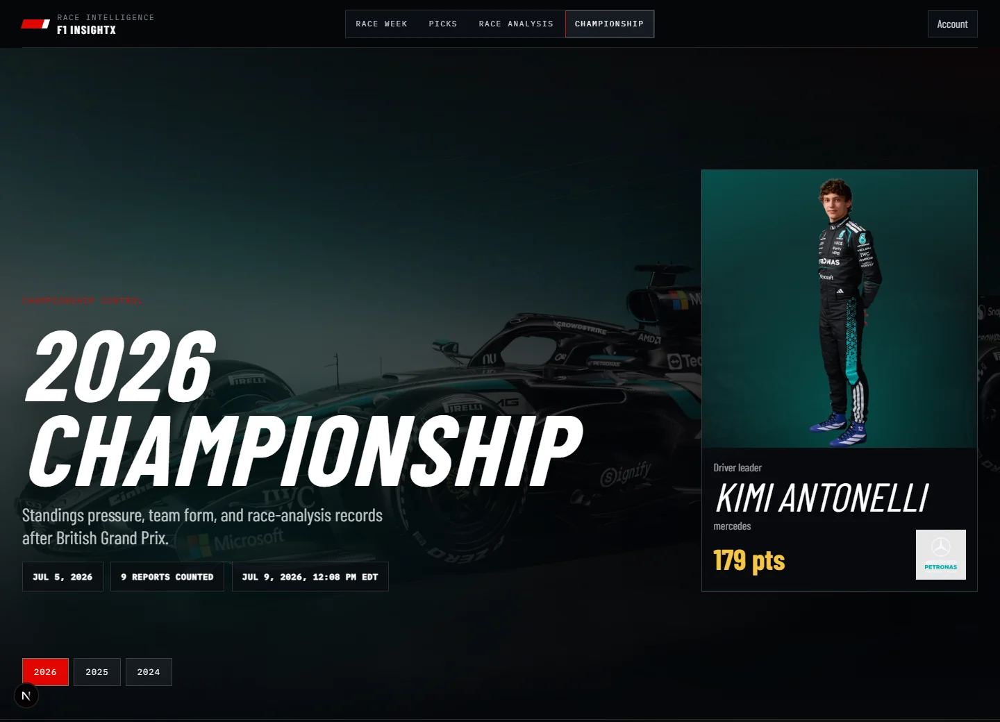

# F1 InsightX

**Premium F1 telemetry and race intelligence.**

F1 InsightX turns deterministic FastF1 data pipelines into focused race-week, strategy, telemetry, championship, and post-race product experiences. The Next.js application reads compact offline-generated product views and indexed shards; it does not parse raw telemetry at runtime.

## Product Preview

### Home - Race Intelligence Overview

First-screen race command view with the next race, current circuit geometry, product navigation, and season context for the active Formula 1 weekend.


### Race Analysis - Post-Race Intelligence

Cinematic completed-race reports built from observed results and deterministic pace, stint, strategy, weather, track-status, traffic-proxy, and position-movement views.



### Race Week - Weekend Command Center

Upcoming-race context, schedule state, circuit features, conditions, and generated race-week signals for the Austrian Grand Prix without inventing unavailable session data.



### Championship - Season Control

Driver, constructor, and race-derived season records with historical year switching and team-aware visual context.



## Product Surfaces

- **Home**: next-race overview, circuit preview, race history, and standings entry points.
- **Race Analysis**: completed-race story, strategy, pace evolution, weather, track-status, traffic-proxy, and position-movement views.
- **Race Week**: current weekend context, schedule, conditions, circuit metadata, and qualifying prediction signals.
- **Strategy Lab**: deterministic stint and race-strategy simulation with explicit assumptions and sensitivity drivers. Current next-race Austrian Grand Prix output is pending.
- **Championship**: driver standings, constructor standings, historical season switching, and achievement-style leaderboards.
- **Account/Profile**: Supabase-backed authentication, profile, privacy, and account-management flows.

Analytics remains an underlying telemetry product layer and data source. The public `/analytics` route currently redirects to `/race-analysis`, so it is not presented as a primary README screenshot surface.

Fantasy is intentionally hidden from the visible product until it is rebuilt as a separate surface.

## Latest Data Snapshot

The latest local product manifest is `product_manifest_20260618T204630Z`, generated at `2026-06-18T20:46:30Z`, with overall status `passed`.

| Surface | Current evidence |
| --- | --- |
| Canonical FastF1 | 361,422 laps, 13,261 results, 46,958 stints, 13,040 session-summary rows, 76 drivers |
| Telemetry features | 13,060 lap-summary rows; 91,569 energy/straight rows; 104,289 corner speed, braking, throttle, and driver-corner rows |
| Analytics layer | 663 sessions, 122,479 driver comparisons, 975,725 segment/braking/throttle rows, 856,389 straight/energy-proxy rows |
| Race Analysis | 52 race analyses, 58,465 pace rows, 58,392 position timeline rows, 1,787 pit-strategy rows |
| Race Week | Austrian Grand Prix, round 8, scheduled `2026-06-28T13:00:00Z`; race-week product view available |
| Strategy Lab | Barcelona Grand Prix strategy product available; Austrian Grand Prix Strategy Lab build pending |

Freshness caveat: `season_state` currently validates but is stale by the product-manifest threshold. Treat current-state copy as release-candidate data until the season state is refreshed.

## Architecture

```text
FastF1 archive
  -> staged session extracts
  -> canonical FastF1 tables
  -> telemetry and deterministic feature layers
  -> compact product views and indexes
  -> Next.js server-first product surfaces
```

| Layer | Purpose |
| --- | --- |
| `data/raw/fastf1` | Generated FastF1 archive, manifests, and cache-adjacent artifacts |
| `data/staged/fastf1` | Generated per-session extracts |
| `data/canonical_fastf1` | Validated canonical laps, results, stints, sessions, and weather |
| `data/telemetry_features` | Telemetry-derived segment, braking, throttle, straight-line, and energy-proxy features |
| `data/strategy_lab` | Deterministic Strategy Lab product views |
| `data/analytics` | Telemetry product views, indexed session shards, and representative trace artifacts |
| `data/race_analysis` | Completed-race intelligence views |
| `data/race_week` | Current race-week context, predictions, circuit metadata, and weekend readiness views |
| Supabase | Authentication, profiles, and deployable database-backed surfaces |

## Local Development

Requirements: Node.js 20+, npm 10+, Python 3.11+, and the Python packages in `data/requirements.txt`.

```bash
npm install
npm run data:install
npm run dev
```

Create `.env.local` from `.env.example` only when testing Supabase-backed auth and profile flows. Never commit real environment files or secrets.

## Validation

```bash
npm run test --workspace web
npm run typecheck
npm run lint --workspace web
npm run build --workspace web
python check_generated_artifacts.py
python validate_product_manifest.py
```

## Data Refresh

Core deterministic refresh order:

```bash
python build_canonical_fastf1.py --start-season 2020 --end-season 2026
python validate_canonical_fastf1.py
python build_telemetry_features.py --start-season 2020 --end-season 2026
python validate_telemetry_features.py
python data/build_strategy_lab_layers.py
python data/build_analytics_views.py
python data/build_analytics_indexes.py
python data/build_analytics_telemetry_traces.py
python validate_analytics_views.py
python validate_analytics_telemetry_traces.py
python data/build_race_analysis_views.py
python validate_race_analysis_views.py
python data/build_race_week_layers.py
python build_season_state.py
python build_product_manifest.py
python validate_product_manifest.py
python check_generated_artifacts.py
```

## Product Integrity

- Energy deployment is a **proxy**, not true ERS or battery telemetry.
- Analytics uses **approximate segments** and does not claim unverified named-corner precision.
- Same-team Analytics colors are comparison aids only; constructor names and telemetry values remain source-derived.
- Position movement, traffic, DRS-window, dirty-air, and related values remain explicitly labelled as proxy or derived where exact evidence is unavailable.
- Race-control causes and exact overtakes are not invented.
- Strategy Lab presents deterministic scenario ranges and assumptions, not ML predictions.

## Artifact and Deployment Policy

Commit source, SQL, migrations, tests, documentation, fixtures, and intentionally small runtime product views. Do not commit raw FastF1 archives, cache data, parquet telemetry, canonical CSVs, telemetry feature CSVs, or large generated Analytics and Race Analysis outputs without an explicit release decision.

The web app targets Vercel using Next.js App Router. Supabase-backed auth/profile flows require:

- `NEXT_PUBLIC_SUPABASE_URL`
- `NEXT_PUBLIC_SUPABASE_ANON_KEY`
- `SUPABASE_SERVICE_ROLE_KEY`
- `NEXT_PUBLIC_APP_URL`
- `NEXT_PUBLIC_PRIVACY_CONTACT_EMAIL`

See [Release Checklist](docs/RELEASE_CHECKLIST.md) for the runtime artifact matrix, build order, Supabase checks, deployment flow, and post-deploy QA.

## Documentation

- [Development](docs/DEVELOPMENT.md)
- [Data Pipeline](docs/DATA_PIPELINE.md)
- [Data Sources](docs/data-sources.md)
- [Analytics](docs/ANALYTICS.md)
- [Strategy Lab](docs/STRATEGY_LAB.md)
- [Deployment](docs/deployment.md)
- [Supabase Auth Setup](docs/supabase-auth-setup.md)
- [Release Checklist](docs/RELEASE_CHECKLIST.md)
