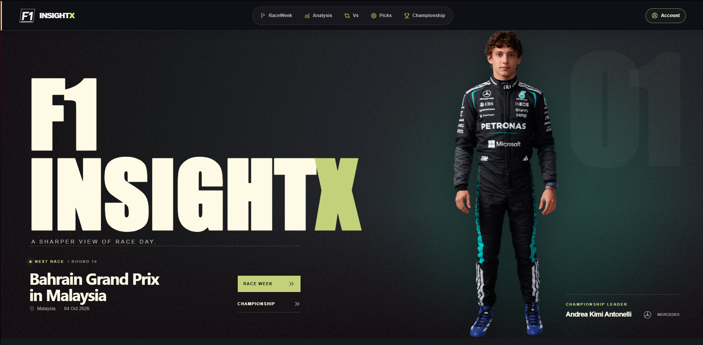
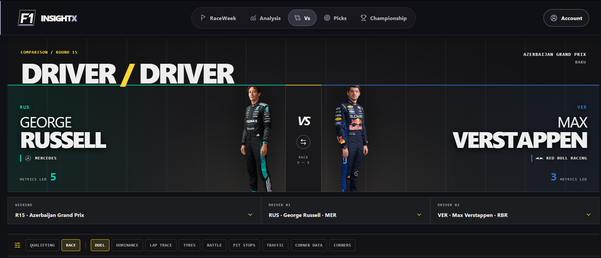
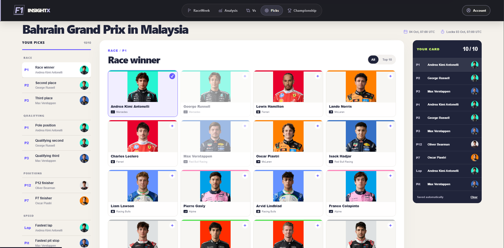
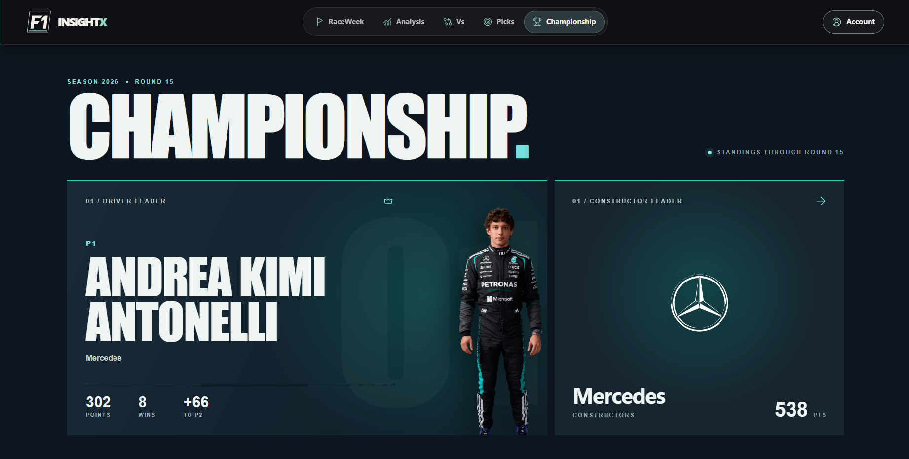

# F1 InsightX

**A sharper view of race day.** F1 InsightX brings the Formula 1 weekend into one place: the next race, post-race reports, driver comparisons, predictions, and championship standings.



## The experience

| Area | What you can do |
| --- | --- |
| **Race Week** | Check the next event's schedule, circuit profile, weather, and qualifying and race projections. |
| **Analysis** | Browse the 2026 race calendar and open completed Grand Prix reports with results, position changes, pace, tyres, pit stops, and timelines where data is available. |
| **Vs** | Select two drivers and a weekend to compare qualifying, race performance, strategy, and available lap and sector data. |
| **Picks** | Fill a race-week card with qualifying, race, position, and speed picks; see lock status and points when results are available. |
| **Championship** | Follow driver and constructor standings, season leaders, wins, and performance rankings. |
| **Account** | Sign in with Google and manage your profile and picks access. |

### Race analysis and driver comparison

| Grand Prix reports | Head-to-head comparisons |
| --- | --- |
|  |  |

### Picks and championship

| Race-week picks | Season standings |
| --- | --- |
|  |  |

*Screenshots captured October 1, 2026. They show a point-in-time season snapshot; the app displays the data available from its current refresh.*

## Data behind the product

F1 InsightX combines reference race results from Jolpica, session and race-control context from OpenF1, and timing, lap, stint, weather, and telemetry data from FastF1. The Python pipeline under [data](data/README.md) validates and turns those inputs into compact product views. The TanStack Start app reads those views from Supabase.

Projections and comparisons are derived from stored inputs. Available data varies by session and race, so some report panels or telemetry views may be absent. The in-app Method page and data dashboard explain sources, freshness, and limitations.

Picks require a signed-in account to edit. Cards are saved automatically in **browser local storage for that account**, and completed-round points are calculated from stored results. Picks and scores do **not** sync across devices.

When Supabase product data is unavailable, public pages can use a bundled fallback snapshot. That snapshot is for continuity and local development; its dates and standings may be older than the latest pipeline data.

## Run locally

### Requirements

- Node.js and npm
- A Supabase project and Google OAuth configuration for live data and account features
- Python only if you plan to run the data pipeline

From the repository root:

```sh
npm install
cp .env.example .env.local
npm run dev
```

Open **http://127.0.0.1:8080**.

Set `VITE_SUPABASE_URL` and `VITE_SUPABASE_PUBLISHABLE_KEY` in `.env.local` to read live product data and use sign-in. Without them, public data routes use the bundled fallback snapshot; account and Picks editing need Supabase. See [the environment template](.env.example) for the other optional settings. Keep `SUPABASE_SERVICE_ROLE_KEY` and `DATABASE_URL` on the server only.

### Checks

```sh
npm run lint
npm run build
```

## Repository guide

| Path | Purpose |
| --- | --- |
| [src/routes](src/routes/README.md) | Product pages and route behavior |
| [src/components](src/components) | Shared navigation, cards, charts, and visualizations |
| [src/lib](src/lib) | Server reads, fallback data, formatting, and app utilities |
| [public/assets](public/assets) | Driver portraits, team logos, and other visual assets |
| [data](data/README.md) | Current ingestion, validation, product views, and Supabase loading |
| [data_pipeline](data_pipeline/README.md) | Historical FastF1 ingestion foundation |

The active application is the TanStack Start project at the repository root. The older Next.js application under `apps/web` is archived.

## Built with

TanStack Start, React, TypeScript, Tailwind CSS, Supabase, FastF1, OpenF1, and Jolpica.

This repository is connected to Lovable. Pushes to `main` sync to the Lovable editor; preserve published commit history and keep the branch buildable.
